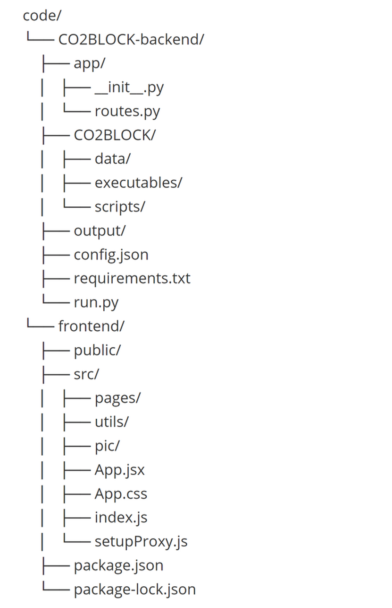

# CO2 Storage Web Interface

This project provides a web interface for the CO2BLOCK tool, which estimates CO₂ storage capacity in saline aquifers. The interface allows users to input geological data, run the model online, and analyze different storage scenarios. The project is built using a Python Flask backend and a React frontend.

<br>

## Project Directory

The backend project is in `CO2BLOCK-backend` folder. `app` directory defines function for different api points to handle requests from frontend. The `data` folder under `CO2BLOCK `directory includes the file of UK offshore reservoirs data and example files. The `executables` folder contains compiled model executable using Matlab compiler. The `scripts` folder includes the modified version of CO2BLOCK scripts with `vpa` and `lambertw` function replaced by numerical solvers. The results generated by model will be saved in the `output` directory. Flask application is created in `run.py`. Required packages are specified in `requirements.txt`.


The frontend project is in `frontend` folder. The `page` directory under `src` contains modules of the interface. `utils` includes utility functions such as file reading and download handling. The components of each module are created in `APP.jsx` according to different routes. Proxy is set up in `setupProxy.js` to send cross-origin request to backend. Required dependencies are specified in `package.json`.<br>




<br><br>

## Prerequisites

Before setting up the project, ensure you have the following software installed:

1. **MATLAB Runtime Compiler**
2. **Node.js**
3. **Python**

<br>

### Installing MATLAB Runtime Compiler

1. Download the MATLAB Runtime Compiler (MRC) from the [official MATLAB website](https://ww2.mathworks.cn/products/compiler/matlab-runtime.html).

2. Follow the installation instructions provided by MathWorks.

3. After installation, add the MRC to your system's PATH variable:

   **On Windows:**

   * Open the Start Menu and search for "Environment Variables."

   - Click on "Edit the system environment variables."

   - In the System Properties window, click "Environment Variables."

   - Under "System variables," select `Path` and click "Edit."

   - Click "New" and add the path to the `bin` folder of the MATLAB Runtime Compiler installation directory.

   - Click "OK" to save your changes.

     

   **On macOS/Linux:**

   - Open your terminal.

   - Run the following command to edit your shell profile (e.g., `.bashrc`, `.zshrc`, `.bash_profile`): 

     ```sh
     nano ~/.bashrc  # or ~/.zshrc, ~/.bash_profile, etc.
     ```

   - Add the following line to the file

     ```sh
     export PATH="/path/to/matlab/runtime/bin:$PATH"
     ```

   - Save the file and run:

     ```sh
     source ~/.bashrc  # or ~/.zshrc, ~/.bash_profile, etc.
     ```


<br>

### Installing Node.js and React Dependencies

1. Download and install Node.js from the official [Node.js website](https://nodejs.org/).
2. After installation, verify that Node.js and npm (Node Package Manager) are installed by running:

    ```sh
    node -v
    npm -v
    ```

3. Navigate to the project’s frontend directory:
    ```sh
    cd /path/to/project/code/frontend
    ```

4. Install React and other project dependencies using npm:
    ```sh
    npm install
    ```


<br>

### Installing Python and Project Dependencies
1.  Download and install Python from the official Python website.
2. Verify the installation by running:
    ```sh
    python --version
    ```
3. Navigate to the project's backend directory:
    ```sh
    cd /path/to/project/code/CO2BLOCK-backend
    ```
4. Install the required Python packages using pip:
    ```sh
    pip install -r requirements.txt
    ```

<br><br>

## Running the Project
First download the `code` directory. 


#### Running the Backend

1. Navigate to the backend directory:
    ```sh
    cd /path/to/project/code/CO2BLOCK-backend
    ```
2. Start the Python Flask server:
    ```sh
    python run.py
    ```

<br>

#### Running the Frontend
1. Navigate to the frontend directory:
    ```sh
    cd /path/to/project/code/frontend
    ```
2. Start the React development server:
    ```sh
    npm start
    ```

<br>

#### Accessing the Web Interface
Once both the backend and frontend servers are running, you can access the web interface by navigating to http://localhost:3000 in your web browser, which is the default port for react applications. The backend by default runs on http://localhost:5000, you can modify it in `run.py` and update `setupProxy.js` accordingly. See the user guide of the functionalities of each web page.

